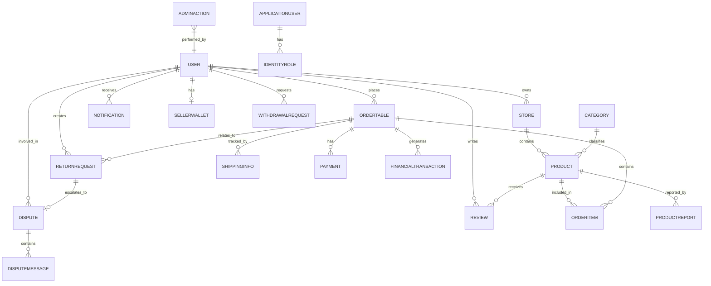
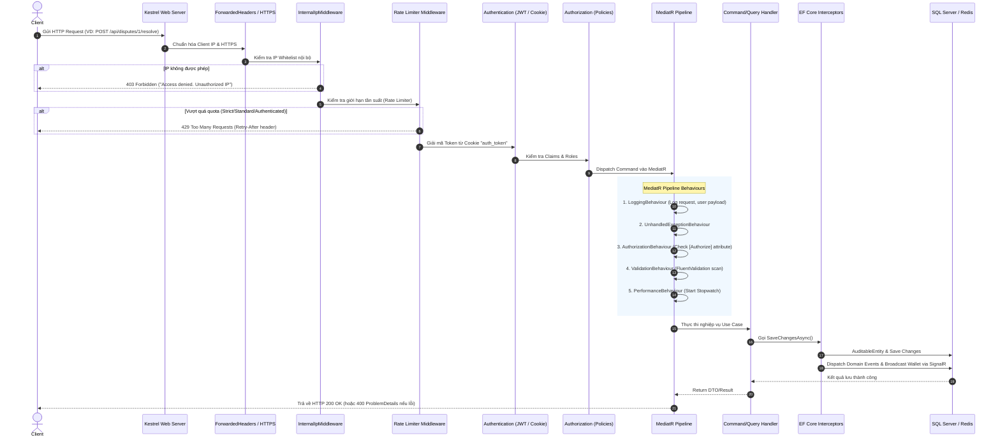
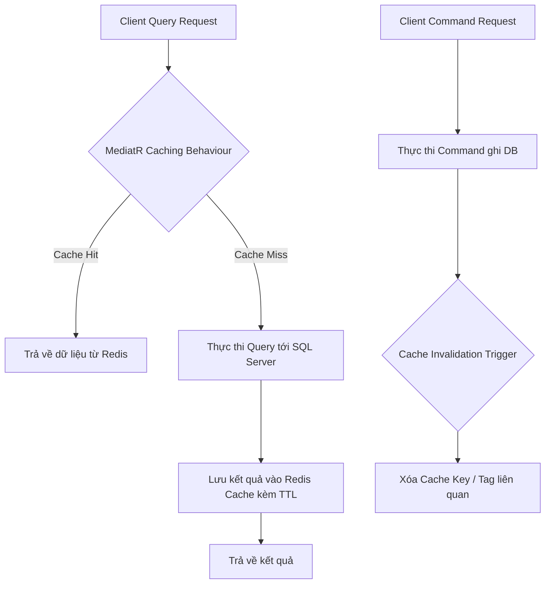

# 1. Mô tả dự án (Project Overview)

### 1.1. Bối cảnh & Mục tiêu
Dự án là nền tảng Backend API kết hợp hệ thống trang quản trị (**Admin Portal**) phục vụ vận hành sàn thương mại điện tử **eBay Clone**. Hệ thống chịu trách nhiệm quản lý toàn bộ vòng đời của sản phẩm, người dùng, giao dịch dòng tiền, giải quyết khiếu nại - tranh chấp, và báo cáo phân tích theo thời gian thực.

Dự án được xây dựng dựa trên **Clean Architecture** kết hợp mô hình **CQRS** (Command Query Responsibility Segregation) và hướng tới việc sẵn sàng mở rộng (containerized, microservice-ready, hỗ trợ scale đa pod với Redis Backplane).

### 1.2. Phân hệ chức năng chính (Core Modules)
1. **Quản lý Tài khoản & Phân quyền (Identity & Access Management):**
   - Đăng nhập xác thực 2 lớp (**2FA/MFA via TOTP Google Authenticator**).
   - Quản lý phiên làm việc bằng **HttpOnly, Secure, SameSite=Strict Cookie**.
   - Phân cấp quản trị: `SuperAdmin`, `Support`, `Monitor`, `Administrator`.
   - Giám sát IP truy cập, Whitelist subnet nội bộ, ngăn chặn tấn công Brute-force qua Rate Limiting.
2. **Quản lý Người dùng & KYC Tự động (User & Seller Management):**
   - Quản lý danh sách, hồ sơ, kiểm duyệt KYC (CCCD, giấy phép kinh doanh).
   - Cơ chế phát hiện tài khoản gian lận/nhân bản (**Anti-Fraud Duplication Detection**) tự động đối chiếu CCCD, IP và định vị địa lý (GPS Latitude/Longitude).
   - Đánh giá xếp hạng Seller Level (`TopRated`, `AboveStandard`, `BelowStandard`) dựa trên điểm hiệu suất (Performance Score).
3. **Quản trị Sản phẩm & Kiểm duyệt Nội dung (Product Moderation & AI):**
   - Quản lý danh mục sản phẩm đa cấp.
   - Tích hợp **OpenAI/OpenRouter** tự động rà soát nội dung sản phẩm và đánh giá (Reviews), phát hiện hàng cấm, vũ khí, chất gây nghiện, ngôn từ độc hại hoặc link spam bằng tiếng Việt & tiếng Anh.
4. **Quản trị Tài chính & Dòng tiền (Financials & Wallet Engine):**
   - Hệ thống ví người bán đa tầng số dư: **Số dư khả dụng** (`AvailableBalance`), **Số dư tạm giữ** (`PendingBalance`), **Số dư đóng băng** (`LockedBalance`).
   - Động cơ tự động quyết toán tiền hàng (**Settlement Engine**): Tự động giải phóng tiền tạm giữ sang khả dụng sau khi đơn hàng hoàn thành và hết thời hạn khiếu nại.
   - Động cơ giải ngân tự động (**Payout Engine**): Lên lịch định kỳ (2:00 AM UTC) chi trả hàng loạt từ ví Seller về tài khoản ngân hàng thông qua cổng thanh toán (Mock Bank Gateway).
5. **Quản lý Khiếu nại, Trả hàng & Tranh chấp (Returns & Disputes):**
   - Xử lý yêu cầu trả hàng (**Return Requests**), cơ chế tự động leo thang (**Auto-Escalation**) sau 3 ngày nếu Seller không phản hồi.
   - Phòng hòa giải tranh chấp thời gian thực (**Dispute Mediation Room**) hỗ trợ nhắn tin trực tiếp và ra phán quyết hoàn tiền giữa Buyer và Seller qua SignalR.
6. **Truyền thông & Báo cáo (Broadcasts, Analytics & Audit):**
   - Bảng điều khiển (Dashboard) thống kê doanh thu, người dùng, giao dịch.
   - Gửi thông báo hệ thống hàng loạt (**Broadcasts**).
   - Lưu vết kiểm toán toàn diện (**Audit Logs**) ghi lại trạng thái trước/sau (`before`/`after` JSON diff) cho từng thao tác của Admin.

---

# 2. Hướng dẫn cài đặt & Thiết lập dự án (Project Setup)

### 2.1. Yêu cầu môi trường
- **.NET SDK**: Phiên bản .NET 8.0 hoặc .NET 10.0 (Preview).
- **Node.js**: Phiên bản 16.x hoặc 18.x trở lên (để chạy React ClientApp).
- **Cơ sở dữ liệu**: Microsoft SQL Server 2022 (hoặc SQL Express / LocalDB / Docker container).
- **Redis**: Redis 7.x (dùng cho SignalR backplane khi chạy cluster hoặc load balancing).
- **Docker & Docker Compose** (Tùy chọn nếu chạy containerized).

### 2.2. Cấu hình biến môi trường & Secrets
Hệ thống sử dụng các khóa cấu hình tại [`src/Web/appsettings.json`](file:///c:/Users/hoang/Downloads/Docs/prn232/Project code/Group3_v2/ebay_clone_adminRole/src/Web/appsettings.json):

| Cấu hình | Mục đích | Giá trị mẫu |
| :--- | :--- | :--- |
| `ConnectionStrings:MyCnn` | Chuỗi kết nối SQL Server | `Server=localhost;Database=CloneEbayDB;User Id=sa;Password=YourPass;Encrypt=True;TrustServerCertificate=True;` |
| `Jwt:Key` | Khóa bí mật ký JWT | Tối thiểu 32 ký tự ngẫu nhiên |
| `Jwt:Issuer` / `Jwt:Audience` | Định danh Token Provider | `EbayClone` / `EbayCloneUsers` |
| `EmailSettings:SmtpServer` | Máy chủ gửi thư SMTP | `smtp.gmail.com` (Port 587, EnableSSL) |
| `OpenAI:ApiKey` | API key OpenAI/OpenRouter kiểm duyệt bài viết | `sk-or-v1-...` |
| `Redis:ConnectionString` | Kết nối Redis Backplane SignalR | `localhost:6379` hoặc để trống nếu chạy single-node |
| `InternalIps` | Whitelist dải IP cho phép truy cập Admin API | `["127.0.0.1", "::1", "192.168.1.*", "10.*"]` |

> [!TIP]
> Trong môi trường Development, khuyến khích sử dụng **User Secrets** để không làm lộ mật khẩu database:
> ```powershell
> cd src/Web
> dotnet user-secrets init
> dotnet user-secrets set "ConnectionStrings:MyCnn" "Server=(localdb)\mssqllocaldb;Database=CloneEbayDB;Trusted_Connection=True;TrustServerCertificate=True"
> ```

### 2.3. Khởi chạy bằng Docker Compose (Khuyên dùng)
Toàn bộ hệ thống (SQL Server 2022 + Redis 7 + Backend API + React Frontend) đã được đóng gói sẵn trong file [`docker-compose.yml`](file:///c:/Users/hoang/Downloads/Docs/prn232/Project code/Group3_v2/ebay_clone_adminRole/docker-compose.yml):

```powershell
# Khởi động toàn bộ stack ngầm
docker-compose up -d --build
```
- Web Application & API: `http://localhost:5000` (Swagger UI tại `http://localhost:5000/api`)
- SQL Server: `localhost:1433`
- Redis: `localhost:6379`

### 2.4. Khởi chạy thủ công từng phần (Local Development)
**Bước 1: Cập nhật Migration Database**
```powershell
cd src/Infrastructure
dotnet ef database update --context ApplicationDbContext --startup-project ../Web
```
*(Lưu ý: Hệ thống đã tích hợp `await app.InitialiseDatabaseAsync();` trong [`Program.cs`](file:///c:/Users/hoang/Downloads/Docs/prn232/Project code/Group3_v2/ebay_clone_adminRole/src/Web/Program.cs), do đó khi chạy ứng dụng, DB sẽ tự động apply migrations và seed dữ liệu nếu chưa có).*

**Bước 2: Chạy Backend Web API**
```powershell
cd src/Web
dotnet run
```
Truy cập: `https://localhost:5001` hoặc `http://localhost:5000`.

**Bước 3: Chạy Frontend React (Nếu dev độc lập ngoài SPA proxy)**
```powershell
cd src/Web/ClientApp
npm install
npm start
```
Frontend React sẽ chạy tại `http://localhost:3000`.

### 2.5. Tài khoản mặc định hệ thống tự sinh (Seed Data)
- **Tài khoản Quản trị cao nhất (SuperAdmin):**
  - Email: `superadmin@ebay.local`
  - Mật khẩu: `Admin123!`
- **Tài khoản Người bán thử nghiệm (Seller):**
  - Username / Email: `tech_seller_pro`
  - Mật khẩu: `Password123!`

---

# 3. Kiến trúc hệ thống (Architecture)

Hệ thống được thiết kế tuân theo **Clean Architecture** (dựa trên nguyên mẫu của Jason Taylor) kết hợp cùng mô hình **CQRS** thông qua thư viện **MediatR**.

```
┌─────────────────────────────────────────────────────────────┐
│                       Presentation Layer                    │
│    src/Web: Minimal APIs, Razor Pages, SignalR Hubs,        │
│             Middlewares, React SPA (ClientApp)              │
└──────────────────────────────┬──────────────────────────────┘
                               │ Phụ thuộc vào
┌──────────────────────────────▼──────────────────────────────┐
│                      Application Layer                      │
│    src/Application: CQRS Use Cases (Commands/Queries),       │
│    DTOs, FluentValidation, MediatR Pipeline Behaviours,     │
│    Interfaces (IApplicationDbContext, IJwtService, v.v.)    │
└──────────────┬──────────────────────────────┬───────────────┘
               │ Phụ thuộc vào               │ Được triển khai bởi
┌──────────────▼──────────────┐ ┌─────────────▼───────────────┐
│        Domain Layer         │ │    Infrastructure Layer     │
│   src/Domain:               │ │   src/Infrastructure:       │
│   Entities, Enums,          │ │   EF Core DbContext,        │
│   Value Objects, Constants, │ │   Interceptors, Migrations, │
│   Domain Events             │ │   Identity, External APIs,  │
│   (KHÔNG phụ thuộc bên ngoài)│ │   Hosted Background Services│
└─────────────────────────────┘ └─────────────────────────────┘
```

### 3.1. Chi tiết từng tầng (Layers)

1. **Domain Layer ([`src/Domain`](file:///c:/Users/hoang/Downloads/Docs/prn232/Project code/Group3_v2/ebay_clone_adminRole/src/Domain)):**
   - Là tầng lõi, độc lập hoàn toàn với framework và cơ sở dữ liệu.
   - Chứa các thực thể chính ([`User`](file:///c:/Users/hoang/Downloads/Docs/prn232/Project code/Group3_v2/ebay_clone_adminRole/src/Domain/Entities/User.cs), [`Product`](file:///c:/Users/hoang/Downloads/Docs/prn232/Project code/Group3_v2/ebay_clone_adminRole/src/Domain/Entities/Product.cs), [`OrderTable`](file:///c:/Users/hoang/Downloads/Docs/prn232/Project code/Group3_v2/ebay_clone_adminRole/src/Domain/Entities/OrderTable.cs), [`SellerWallet`](file:///c:/Users/hoang/Downloads/Docs/prn232/Project code/Group3_v2/ebay_clone_adminRole/src/Domain/Entities/SellerWallet.cs), [`Dispute`](file:///c:/Users/hoang/Downloads/Docs/prn232/Project code/Group3_v2/ebay_clone_adminRole/src/Domain/Entities/Dispute.cs), [`AdminAction`](file:///c:/Users/hoang/Downloads/Docs/prn232/Project code/Group3_v2/ebay_clone_adminRole/src/Domain/Entities/AdminAction.cs)).
   - Kế thừa lớp cơ sở [`BaseAuditableEntity`](file:///c:/Users/hoang/Downloads/Docs/prn232/Project code/Group3_v2/ebay_clone_adminRole/src/Domain/Common/BaseAuditableEntity.cs) (hỗ trợ audit: `CreatedAt`, `CreatedBy`, `LastModified`, `LastModifiedBy`) và [`BaseEntity`](file:///c:/Users/hoang/Downloads/Docs/prn232/Project code/Group3_v2/ebay_clone_adminRole/src/Domain/Common/BaseEntity.cs) (hỗ trợ Domain Events).
   - Chứa hằng số quyền hạn [`Roles`](file:///c:/Users/hoang/Downloads/Docs/prn232/Project code/Group3_v2/ebay_clone_adminRole/src/Domain/Constants/Roles.cs) và chính sách [`Policies`](file:///c:/Users/hoang/Downloads/Docs/prn232/Project code/Group3_v2/ebay_clone_adminRole/src/Domain/Constants/Policies.cs).

2. **Application Layer ([`src/Application`](file:///c:/Users/hoang/Downloads/Docs/prn232/Project code/Group3_v2/ebay_clone_adminRole/src/Application)):**
   - Triển khai nghiệp vụ ứng dụng thông qua mô hình CQRS: Mỗi chức năng được chia thành **Command** (thay đổi trạng thái) hoặc **Query** (đọc dữ liệu) kèm theo Request Handler tương ứng.
   - Định nghĩa các Abstraction Interfaces: [`IApplicationDbContext`](file:///c:/Users/hoang/Downloads/Docs/prn232/Project code/Group3_v2/ebay_clone_adminRole/src/Application/Common/Interfaces/IApplicationDbContext.cs), [`IIdentityService`](file:///c:/Users/hoang/Downloads/Docs/prn232/Project code/Group3_v2/ebay_clone_adminRole/src/Application/Common/Interfaces/IIdentityService.cs), [`IJwtService`](file:///c:/Users/hoang/Downloads/Docs/prn232/Project code/Group3_v2/ebay_clone_adminRole/src/Application/Common/Interfaces/IJwtService.cs), [`IContentModerationService`](file:///c:/Users/hoang/Downloads/Docs/prn232/Project code/Group3_v2/ebay_clone_adminRole/src/Application/Common/Interfaces/IContentModerationService.cs), [`IDisputeNotifier`](file:///c:/Users/hoang/Downloads/Docs/prn232/Project code/Group3_v2/ebay_clone_adminRole/src/Application/Common/Interfaces/IDisputeNotifier.cs), [`ISellerHubService`](file:///c:/Users/hoang/Downloads/Docs/prn232/Project code/Group3_v2/ebay_clone_adminRole/src/Application/Common/Interfaces/ISellerHubService.cs).
   - Tích hợp kiểm tra hợp lệ dữ liệu bằng **FluentValidation** và ánh xạ DTO bằng **AutoMapper**.
   - Pipeline Behaviours (Cross-cutting Concerns): Tự động bắt lỗi, kiểm tra bảo mật, validation, ghi log và đo lường hiệu năng cho toàn bộ request.

3. **Infrastructure Layer ([`src/Infrastructure`](file:///c:/Users/hoang/Downloads/Docs/prn232/Project code/Group3_v2/ebay_clone_adminRole/src/Infrastructure)):**
   - Triển khai tầng Data Access với EF Core qua [`ApplicationDbContext`](file:///c:/Users/hoang/Downloads/Docs/prn232/Project code/Group3_v2/ebay_clone_adminRole/src/Infrastructure/Data/ApplicationDbContext.cs).
   - Quản trị danh tính với **ASP.NET Core Identity** ([`ApplicationUser`](file:///c:/Users/hoang/Downloads/Docs/prn232/Project code/Group3_v2/ebay_clone_adminRole/src/Infrastructure/Identity/ApplicationUser.cs)).
   - EF Core Interceptors:
     - [`AuditableEntityInterceptor`](file:///c:/Users/hoang/Downloads/Docs/prn232/Project code/Group3_v2/ebay_clone_adminRole/src/Infrastructure/Data/Interceptors/AuditableEntityInterceptor.cs): Tự động điền ngày giờ và User thực hiện khi thêm/sửa bản ghi.
     - [`DispatchDomainEventsInterceptor`](file:///c:/Users/hoang/Downloads/Docs/prn232/Project code/Group3_v2/ebay_clone_adminRole/src/Infrastructure/Data/Interceptors/DispatchDomainEventsInterceptor.cs): Tự động kích hoạt Domain Events qua MediatR khi hoàn tất transaction.
     - [`SellerWalletChangedInterceptor`](file:///c:/Users/hoang/Downloads/Docs/prn232/Project code/Group3_v2/ebay_clone_adminRole/src/Infrastructure/Data/Interceptors/SellerWalletChangedInterceptor.cs): Bắt sự kiện thay đổi số dư ví người bán và đẩy tin tức thì qua SignalR.
   - Triển khai dịch vụ bên ngoài: AI Content Moderation qua OpenAI API ([`OpenAiModerationService`](file:///c:/Users/hoang/Downloads/Docs/prn232/Project code/Group3_v2/ebay_clone_adminRole/src/Infrastructure/Services/OpenAiModerationService.cs)), Gửi Email qua SMTP ([`EmailService`](file:///c:/Users/hoang/Downloads/Docs/prn232/Project code/Group3_v2/ebay_clone_adminRole/src/Infrastructure/Services/EmailService.cs)), Cổng thanh toán giả lập ([`MockPaymentGatewayService`](file:///c:/Users/hoang/Downloads/Docs/prn232/Project code/Group3_v2/ebay_clone_adminRole/src/Infrastructure/Services/MockPaymentGatewayService.cs)).

4. **Web / Presentation Layer ([`src/Web`](file:///c:/Users/hoang/Downloads/Docs/prn232/Project code/Group3_v2/ebay_clone_adminRole/src/Web)):**
   - Sử dụng **ASP.NET Core Minimal APIs** thông qua cấu trúc [`EndpointGroupBase`](file:///c:/Users/hoang/Downloads/Docs/prn232/Project code/Group3_v2/ebay_clone_adminRole/src/Web/Infrastructure/EndpointGroupBase.cs) và cơ chế tự động scan đăng ký qua reflection [`MapEndpoints`](file:///c:/Users/hoang/Downloads/Docs/prn232/Project code/Group3_v2/ebay_clone_adminRole/src/Web/Infrastructure/IEndpointRouteBuilderExtensions.cs).
   - SignalR Hubs: [`DisputeHub`](file:///c:/Users/hoang/Downloads/Docs/prn232/Project code/Group3_v2/ebay_clone_adminRole/src/Web/Hubs/DisputeHub.cs), [`NotificationHub`](file:///c:/Users/hoang/Downloads/Docs/prn232/Project code/Group3_v2/ebay_clone_adminRole/src/Web/Hubs/NotificationHub.cs), [`SellerHub`](file:///c:/Users/hoang/Downloads/Docs/prn232/Project code/Group3_v2/ebay_clone_adminRole/src/Web/Hubs/SellerHub.cs).
   - Custom Middleware: Chặn IP lạ ([`InternalIpMiddleware`](file:///c:/Users/hoang/Downloads/Docs/prn232/Project code/Group3_v2/ebay_clone_adminRole/src/Web/Infrastructure/InternalIpMiddleware.cs)), Giới hạn tần suất gọi ([`RateLimitingExtensions`](file:///c:/Users/hoang/Downloads/Docs/prn232/Project code/Group3_v2/ebay_clone_adminRole/src/Web/Infrastructure/RateLimitingExtensions.cs)), Security Headers ([`SecurityHeadersMiddleware`](file:///c:/Users/hoang/Downloads/Docs/prn232/Project code/Group3_v2/ebay_clone_adminRole/src/Web/Infrastructure/SecurityHeadersMiddleware.cs)), Xử lý ngoại lệ chuẩn RFC 7807 ([`CustomExceptionHandler`](file:///c:/Users/hoang/Downloads/Docs/prn232/Project code/Group3_v2/ebay_clone_adminRole/src/Web/Infrastructure/CustomExceptionHandler.cs)).
   - Frontend SPA React nằm tại `ClientApp`.

---

# 4. Cơ sở dữ liệu (Database Schema & ORM)

Hệ thống sử dụng **Microsoft SQL Server** với ORM **Entity Framework Core** theo cơ chế Code-First.

### 4.1. Sơ đồ thực thể quan hệ (ERD Overview)



### 4.2. Các nhóm bảng dữ liệu chính

#### Nhóm 1: Nhóm nghiệp vụ E-Commerce cốt lõi
- **`User`**: Lưu trữ thông tin tài khoản người dùng, mật khẩu hash BCrypt, trạng thái phê duyệt (`ApprovalStatus`), KYC (`CCCD`, `IsVerified`), Định vị chống gian lận (`Latitude`, `Longitude`, `LastLoginIp`), Xếp hạng Seller (`SellerLevel`), Cờ 2FA (`TwoFactorEnabled`, `TwoFactorSecret`).
- **`Store` & `Category`**: Thông tin gian hàng của Seller và cây phân loại sản phẩm.
- **`Product` & `Inventory`**: Thông tin sản phẩm, loại bán (mua ngay hoặc đấu giá `isAuction`), giá, số lượng tồn kho.
- **`OrderTable` & `OrderItem`**: Đơn đặt hàng, trạng thái thanh toán, tổng giá trị, ngày hoàn tất, ngày dự kiến quyết toán (`EstimatedSettlementDate`).
- **`Payment` & `ShippingInfo`**: Thông tin thanh toán và mã vận đơn vận chuyển hàng hóa.

#### Nhóm 2: Nhóm Quản trị Admin, Kiểm duyệt & Rủi ro
- **`ProductReport`**: Báo cáo vi phạm sản phẩm (bao gồm chương trình quyền sở hữu trí tuệ VeRO - Verified Rights Owner), kết quả phân tích AI Flag.
- **`Review` & `ReviewReport`**: Đánh giá sản phẩm của người mua và báo cáo vi phạm bình luận độc hại.
- **`ReturnRequest`**: Yêu cầu trả hàng của người mua (`Pending`, `Approved`, `Rejected`, `Escalated`, `Completed`).
- **`Dispute` & `DisputeMessage`**: Phiên tranh chấp chính thức khi khiếu nại không hòa giải được, lưu lại tin nhắn của Buyer, Seller và quyết định của Admin (`BuyerFavored`, `SellerFavored`, `RefundAmount`).
- **`AdminAction` (Audit Trail)**: Ghi log toàn bộ thao tác nhạy cảm của Admin với trường `Details` chứa cấu trúc JSON `{ "before": ..., "after": ... }`.

#### Nhóm 3: Nhóm Ví & Tài chính (Financials & Settlement)
- **`SellerWallet`**: Ví người bán với cấu trúc 3 số dư riêng biệt:
  - `AvailableBalance`: Số dư khả dụng, người bán có thể tạo lệnh rút tiền bất kỳ lúc nào.
  - `PendingBalance`: Số dư tạm giữ khi đơn hàng thành công, sẽ được tự động giải phóng sang AvailableBalance sau số ngày quy định của Seller Level.
  - `LockedBalance`: Số dư bị đóng băng phục vụ bảo lãnh khiếu nại/tranh chấp.
- **`FinancialTransaction`**: Sổ cái ghi chép mọi biến động số dư (Doanh thu bán hàng, phí sàn, tiền hoàn cho khách, tiền rút ra).
- **`PlatformFee`**: Biểu phí hoa hồng sàn theo từng danh mục sản phẩm (phần trăm cố định hoặc phí bậc thang).
- **`PayoutConfig` & `PayoutTransaction`**: Cấu hình thời gian giải ngân tự động hàng ngày và lịch sử giao dịch giải ngân hàng loạt.
- **`SellerLevelCriteria`**: Ngưỡng tiêu chí đánh giá thứ hạng người bán (Thời gian tạm giữ tiền tương ứng từng cấp độ, số đơn tối thiểu, điểm vi phạm tối đa).
- **`WithdrawalRequest`**: Yêu cầu rút tiền thủ công từ người bán.

#### Nhóm 4: Nhóm Identity (ASP.NET Core Identity Tables)
- Các bảng chuẩn: `AspNetUsers`, `AspNetRoles`, `AspNetUserRoles`, `AspNetUserClaims`, `AspNetRoleClaims`.
- Đảm bảo tách biệt giữa định danh quản trị hệ thống (`ApplicationUser`) và các thực thể khách hàng domain (`User`).

---

# 5. Vòng đời Request & Pipeline Middleware

Khi một HTTP Request từ trình duyệt gửi tới Web Server, nó đi qua một chuỗi Middleware theo đúng thứ tự nghiêm ngặt trước khi đến Endpoint Handler và MediatR Pipeline.

### 5.1. Sơ đồ tuần tự xử lý Request (Request Processing Flow)



### 5.2. Chi tiết các Middleware trong [`Program.cs`](file:///c:/Users/hoang/Downloads/Docs/prn232/Project code/Group3_v2/ebay_clone_adminRole/src/Web/Program.cs)

1. **`app.UseForwardedHeaders()`**: Đảm bảo đọc chính xác địa chỉ IP thật của Client khi chạy sau Nginx, Ingress Controller hoặc Docker Reverse Proxy.
2. **`app.UseHealthChecks("/health")`**: Endpoint kiểm tra trạng thái hoạt động của Service và kết nối SQL Server.
3. **`app.UseHttpsRedirection()`**: Chuyển hướng tự động sang giao thức HTTPS an toàn.
4. **`app.UseMiddleware<InternalIpMiddleware>()`**:
   - Chặn đứng các truy cập trái phép vào Admin API từ các dải IP không nằm trong cấu hình `InternalIps`.
   - Ghi nhận hoạt động vào dịch vụ [`ActiveConnectionTracker`](file:///c:/Users/hoang/Downloads/Docs/prn232/Project code/Group3_v2/ebay_clone_adminRole/src/Web/Infrastructure/ActiveConnectionTracker.cs) và phát broadcast tới Admin Dashboard qua SignalR.
5. **`app.UseStaticFiles()`**: Phục vụ các file tĩnh của React build trong thư mục `wwwroot`.
6. **`app.UseExceptionHandler()` -> [`CustomExceptionHandler`](file:///c:/Users/hoang/Downloads/Docs/prn232/Project code/Group3_v2/ebay_clone_adminRole/src/Web/Infrastructure/CustomExceptionHandler.cs)**:
   - Chuyển đổi ngoại lệ thành chuẩn **RFC 7807 Problem Details**:
     - `ValidationException` $\rightarrow$ `400 Bad Request` kèm danh sách lỗi chi tiết từng trường.
     - `NotFoundException` $\rightarrow$ `404 Not Found`.
     - `UnauthorizedAccessException` $\rightarrow$ `401 Unauthorized`.
     - `ForbiddenAccessException` $\rightarrow$ `403 Forbidden`.
7. **`app.UseCors("FrontendPolicy")`**: Cho phép kết nối từ React Dev Server (`localhost:3000`, `localhost:5000`) và kích hoạt `.AllowCredentials()` để trình duyệt tự động đính kèm Cookie.
8. **`app.UseRateLimiter()`**:
   - **Đặt trước Authentication** để ngăn chặn tấn công DoS / Brute-force làm tê liệt hệ thống xác thực.
9. **`app.UseAuthentication()` & `app.UseAuthorization()`**: Xác thực danh tính và áp dụng chính sách phân quyền.
10. **`app.MapHub<...>()` & `app.MapEndpoints()`**: Điều phối request vào SignalR WebSocket Hubs hoặc Minimal API Endpoints.
11. **`app.MapFallbackToFile("index.html")`**: Hỗ trợ HTML5 Client-Side Routing cho Single Page Application (React).

### 5.3. Chuỗi MediatR Pipeline Behaviours trong Application Layer

Tất cả các Command và Query khi đi vào MediatR đều đi xuyên qua 5 lớp xử lý độc lập tại [`src/Application/Common/Behaviours`](file:///c:/Users/hoang/Downloads/Docs/prn232/Project code/Group3_v2/ebay_clone_adminRole/src/Application/Common/Behaviours):

1. **[`LoggingBehaviour<TRequest>`](file:///c:/Users/hoang/Downloads/Docs/prn232/Project code/Group3_v2/ebay_clone_adminRole/src/Application/Common/Behaviours/LoggingBehaviour.cs)**:
   - Tiền xử lý (`IRequestPreProcessor`): Tự động trích xuất thông tin `UserId`, `UserName`, Tên Request và toàn bộ JSON payload để ghi log.
2. **[`UnhandledExceptionBehaviour<TRequest, TResponse>`](file:///c:/Users/hoang/Downloads/Docs/prn232/Project code/Group3_v2/ebay_clone_adminRole/src/Application/Common/Behaviours/UnhandledExceptionBehaviour.cs)**:
   - Bao bọc toàn bộ khối thực thi trong `try-catch`, ghi log Error kèm stack trace nếu có ngoại lệ bất thường xảy ra.
3. **[`AuthorizationBehaviour<TRequest, TResponse>`](file:///c:/Users/hoang/Downloads/Docs/prn232/Project code/Group3_v2/ebay_clone_adminRole/src/Application/Common/Behaviours/AuthorizationBehaviour.cs)**:
   - Đọc các attribute `[Authorize(Roles = "...")]` hoặc `[Authorize(Policy = "...")]` được khai báo trực tiếp trên class Command/Query. Nếu không đạt yêu cầu sẽ ném ra `UnauthorizedAccessException` hoặc `ForbiddenAccessException`.
4. **[`ValidationBehaviour<TRequest, TResponse>`](file:///c:/Users/hoang/Downloads/Docs/prn232/Project code/Group3_v2/ebay_clone_adminRole/src/Application/Common/Behaviours/ValidationBehaviour.cs)**:
   - Tìm kiếm toàn bộ các validator kế thừa `AbstractValidator<TRequest>` trong hệ thống. Tự động kiểm tra tính hợp lệ của dữ liệu đầu vào. Nếu vi phạm sẽ ngắt luồng và ném ra `ValidationException` (trả về lỗi 400).
5. **[`PerformanceBehaviour<TRequest, TResponse>`](file:///c:/Users/hoang/Downloads/Docs/prn232/Project code/Group3_v2/ebay_clone_adminRole/src/Application/Common/Behaviours/PerformanceBehaviour.cs)**:
   - Khởi động `Stopwatch` đo thời gian chạy của Handler. Nếu thời gian thực thi vượt quá **500 milliseconds**, hệ thống tự động ghi nhận cảnh báo Warning Log: `EbayClone Long Running Request` kèm định danh user để đội ngũ phát triển tối ưu query.

---

# 6. Xác thực & Phân quyền (Authentication & Authorization)

### 6.1. Cơ chế Xác thực (Authentication - AuthN)
Hệ thống kết hợp mô hình **Domain User Authentication** (mật khẩu mã hóa BCrypt) với **JSON Web Token (JWT)** được lưu trữ trong **HttpOnly Cookie**:

1. **Luồng Đăng nhập (Login Flow):**
   - Client gửi thông tin email và password tới endpoint `POST /api/auth/login`.
   - Hệ thống xác minh hash mật khẩu qua `BCrypt.Net.BCrypt.Verify`.
   - Kiểm tra trạng thái tài khoản: Nếu tài khoản bị `Banned`, từ chối ngay lập tức kèm theo lý do bị cấm.
   - Kiểm tra xác thực 2 bước: Nếu `TwoFactorEnabled == true`, trả về cờ `requireTwoFactor: true` và `userId` mà **chưa cấp token**.
   - Nếu đăng nhập thông thường hợp lệ: Sinh chuỗi JWT Token qua [`JwtService`](file:///c:/Users/hoang/Downloads/Docs/prn232/Project code/Group3_v2/ebay_clone_adminRole/src/Infrastructure/Services/JwtService.cs) với các Claims (`NameIdentifier`, `Email`, `Role`, `twoFactorEnabled`).
   - Token được ghi vào Cookie response:
     ```csharp
     http.Response.Cookies.Append("auth_token", result.Token!, new CookieOptions
     {
         HttpOnly = true,                  // Chống truy cập từ JavaScript (Ngăn chặn tấn công XSS đánh cắp token)
         Secure = true,                    // Chỉ truyền qua kênh HTTPS
         SameSite = SameSiteMode.Strict,   // Ngăn chặn tấn công CSRF
         Expires = DateTimeOffset.UtcNow.AddDays(7)
     });
     ```
   - **Xóa trường Token khỏi response body** trước khi trả về client để đảm bảo token không bao giờ bị lưu trữ bừa bãi trên LocalStorage.

2. **Xác thực 2 bước (Two-Factor Authentication - 2FA):**
   - Sử dụng thư viện `OtpNet` tuân thủ chuẩn TOTP (RFC 6238).
   - **Bật 2FA:** Gọi `POST /api/auth/enable-2fa`, hệ thống sinh Secret Key ngẫu nhiên và dùng `QRCoder` chuyển thành ảnh Base64 mã QR cho người dùng quét bằng ứng dụng Google Authenticator.
   - **Xác nhận kích hoạt:** Người dùng nhập mã 6 số gửi lên `POST /api/auth/verify-2fa-setup`.
   - **Đăng nhập với 2FA:** Sau bước nhập mật khẩu, người dùng nhập mã TOTP gửi lên `POST /api/auth/verify-2fa`. Handler kiểm tra `totp.VerifyTotp(code)` và cấp cookie `auth_token` khi thành công.

3. **Xác thực qua SignalR WebSocket:**
   - Do trình duyệt không cho phép tùy biến HTTP Headers trong quá trình nâng cấp kết nối WebSocket (Handshake), [`DependencyInjection.cs`](file:///c:/Users/hoang/Downloads/Docs/prn232/Project code/Group3_v2/ebay_clone_adminRole/src/Web/DependencyInjection.cs) đã cấu hình sự kiện `OnMessageReceived` của JwtBearer:
     1. Ưu tiên đọc Token từ cookie `auth_token`.
     2. Nếu không có cookie, trích xuất token từ Query String `?access_token=...` đối với các đường dẫn bắt đầu bằng `/hubs`.

### 6.2. Cơ chế Phân quyền (Authorization - AuthZ)
Hệ thống áp dụng kết hợp **RBAC** (Role-Based Access Control) và **PBAC** (Policy-Based Access Control):

- **Bốn vai trò quản trị chính (Roles):**
  1. `SuperAdmin`: Toàn quyền hệ thống, quản lý tài khoản Admin, phân quyền, xem nhật ký kiểm toán và thanh trừng dữ liệu.
  2. `Support`: Hỗ trợ khách hàng, duyệt người dùng, giải quyết khiếu nại/tranh chấp, kiểm duyệt sản phẩm và đánh giá.
  3. `Monitor`: Giám sát viên, chỉ có quyền xem Dashboard và các báo cáo thống kê.
  4. `Administrator`: Quản trị viên cấp cao.

- **Bảng ma trận Phân quyền Policy (Defined in Infrastructure):**

| Chính sách (Policy) | Quyền hạn tương ứng | Các Role được cấp quyền |
| :--- | :--- | :--- |
| `CanPurge` | Xóa vĩnh viễn dữ liệu hệ thống | `SuperAdmin` |
| `ViewDashboard` | Xem màn hình Dashboard tổng quan | `Monitor`, `Support`, `SuperAdmin` |
| `ViewReports` | Xem và xuất báo cáo tài chính, hiệu suất | `Monitor`, `SuperAdmin` |
| `ManageUsers` | Phê duyệt, khóa, mở khóa người dùng, áp phạt | `Support`, `SuperAdmin` |
| `ManageProducts` | Kiểm duyệt sản phẩm, xử lý vi phạm bản quyền | `Support`, `SuperAdmin` |
| `ManageOrders` | Quản lý và theo dõi tiến độ đơn hàng | `Support`, `SuperAdmin` |
| `ManageDisputes` | Can thiệp tranh chấp, quyết định hoàn tiền | `Support`, `SuperAdmin` |
| `ModerateReviews` | Xóa đánh giá độc hại, phạt người đánh giá | `Support`, `SuperAdmin` |
| `ManageBroadcasts`| Gửi thông báo toàn sàn | `Support`, `SuperAdmin` |
| `ManageAdminRoles`| Tạo, sửa, phân quyền cho các tài khoản Admin | `SuperAdmin` |
| `ViewAuditLogs` | Tra cứu lịch sử thao tác của các Admin khác | `SuperAdmin` |

### 6.3. Chính sách Giới hạn Tần suất (Rate Limiting Policies)
Được cấu hình trong [`RateLimitingExtensions.cs`](file:///c:/Users/hoang/Downloads/Docs/prn232/Project code/Group3_v2/ebay_clone_adminRole/src/Web/Infrastructure/RateLimitingExtensions.cs):
- **`strict` (Fixed Window):** Tối đa **5 requests / 60 giây theo IP**. Không cho phép hàng đợi (`QueueLimit = 0`). Áp dụng cho endpoint nhạy cảm: `login`, `verify-2fa`.
- **`standard` (Fixed Window):** Tối đa **60 requests / 60 giây theo IP**. Áp dụng cho các endpoint thông thường: `logout`, `me`.
- **`authenticated` (Sliding Window):** Tối đa **200 requests / 60 giây theo UserId** (chia làm 6 segments, mỗi segment 10 giây). Áp dụng cho các thao tác của người dùng đã đăng nhập.
- Khi bị giới hạn, hệ thống trả về mã lỗi `429 Too Many Requests` kèm HTTP Header `Retry-After`.

---

# 7. Tích hợp bên thứ ba & Xử lý bất đồng bộ

### 7.1. Tích hợp Dịch vụ bên thứ ba (Third-Party Services)

1. **Kiểm duyệt nội dung tự động bằng AI ([`OpenAiModerationService`](file:///c:/Users/hoang/Downloads/Docs/prn232/Project code/Group3_v2/ebay_clone_adminRole/src/Infrastructure/Services/OpenAiModerationService.cs)):**
   - Kết nối tới OpenAI API hoặc OpenRouter AI Endpoint.
   - Prompt chuyên dụng phát hiện hàng cấm (vũ khí, ma túy, hàng lậu), từ ngữ thù địch, thô tục, link lừa đảo bằng tiếng Việt.
   - Nếu phát hiện vi phạm, hệ thống tự động gắn cờ vi phạm `TOXIC: [Lý do]`, cảnh báo cho Admin trên trang kiểm duyệt sản phẩm và đánh giá.
2. **Hệ thống Gửi Thư Điện tử ([`EmailService`](file:///c:/Users/hoang/Downloads/Docs/prn232/Project code/Group3_v2/ebay_clone_adminRole/src/Infrastructure/Services/EmailService.cs)):**
   - Kết nối tới Gmail SMTP Server (Port 587, TLS).
   - Gửi email cảnh báo vi phạm, thông báo khóa tài khoản hoặc xác nhận yêu cầu trả hàng bằng giao diện HTML.
3. **Cổng thanh toán ngân hàng giả lập ([`MockPaymentGatewayService`](file:///c:/Users/hoang/Downloads/Docs/prn232/Project code/Group3_v2/ebay_clone_adminRole/src/Infrastructure/Services/MockPaymentGatewayService.cs)):**
   - Mô phỏng giao dịch chuyển khoản ngân hàng phục vụ Động cơ chi trả (Payout Engine).
   - Tái hiện độ trễ mạng thực tế (100ms - 500ms).
   - Tỷ lệ thành công 90%, 10% trả về các lỗi thực tế ngẫu nhiên (Vượt hạn mức chuyển khoản, tài khoản đóng, ngân hàng bảo trì, kích hoạt cơ chế chống rửa tiền).
4. **Azure Key Vault ([`builder.AddKeyVaultIfConfigured`](file:///c:/Users/hoang/Downloads/Docs/prn232/Project code/Group3_v2/ebay_clone_adminRole/src/Web/DependencyInjection.cs)):**
   - Tự động nạp connection strings và secrets trực tiếp từ Azure Key Vault qua `DefaultAzureCredential` khi triển khai production trên Azure.

### 7.2. Xử lý Tác vụ nền (Background Hosted Services)

Hệ thống duy trì 5 Background Service chạy ngầm độc lập kế thừa `BackgroundService`:

| Tên Background Service | Chu kỳ thực thi | Nghiệp vụ xử lý |
| :--- | :--- | :--- |
| **[`PayoutEngineBackgroundService`](file:///c:/Users/hoang/Downloads/Docs/prn232/Project code/Group3_v2/ebay_clone_adminRole/src/Web/Services/PayoutEngineBackgroundService.cs)** | Hàng ngày lúc 2:00 AM UTC (hoặc bấm Force Run) | Quét toàn bộ yêu cầu rút tiền và số dư khả dụng của Seller, gọi `RunPayoutEngineCommand` để giải ngân hàng loạt qua cổng thanh toán ngân hàng. |
| **[`SettlementBackgroundService`](file:///c:/Users/hoang/Downloads/Docs/prn232/Project code/Group3_v2/ebay_clone_adminRole/src/Web/Services/SettlementBackgroundService.cs)** | Định kỳ mỗi 15 giây | Quét các đơn hàng đã giao thành công và quá hạn khiếu nại (`EstimatedSettlementDate <= Now`), tự động chuyển tiền từ `PendingBalance` sang `AvailableBalance` trong ví Seller. |
| **[`SellerEvaluationBackgroundService`](file:///c:/Users/hoang/Downloads/Docs/prn232/Project code/Group3_v2/ebay_clone_adminRole/src/Web/Services/SellerEvaluationBackgroundService.cs)** | Ngày 20 hàng tháng (hoặc cờ FORCE_EVALUATION) | Tính toán lại điểm tín nhiệm (Performance Score), tỷ lệ khiếu nại, tự động nâng/hạ cấp bậc người bán (`TopRated`, `AboveStandard`, `BelowStandard`). |
| **[`AutoReviewUsersService`](file:///c:/Users/hoang/Downloads/Docs/prn232/Project code/Group3_v2/ebay_clone_adminRole/src/Infrastructure/Services/AutoReviewUsersService.cs)** | Định kỳ mỗi 15 giây | Xử lý danh sách người dùng mới đăng ký ở trạng thái `PendingApproval`. Quét trùng số CCCD, trùng địa chỉ IP kèm tọa độ GPS. Tự động Reject & Ban nếu trùng lặp, ngược lại tự động Approve. |
| **[`ReturnRequestEscalationService`](file:///c:/Users/hoang/Downloads/Docs/prn232/Project code/Group3_v2/ebay_clone_adminRole/src/Infrastructure/Services/ReturnRequestEscalationService.cs)** | Định kỳ mỗi 1 giờ | Quét các yêu cầu trả hàng ở trạng thái `Pending` quá 3 ngày mà người bán không xử lý. Tự động chuyển trạng thái thành `Escalated` để Admin can thiệp giải quyết. |

### 7.3. Giao tiếp Thời gian thực (Real-time Messaging với SignalR & Redis)
- **3 SignalR Hubs chính:**
  - `DisputeHub` (`/hubs/dispute`): Thông báo tức thì khi có tranh chấp mới hoặc phán quyết hoàn tiền từ Admin.
  - `NotificationHub` (`/hubs/notifications`): Gửi thông báo cá nhân (Group `User_{id}`) hoặc phân nhóm theo vai trò (Group `Admins`, `Support`).
  - `SellerHub` (`/hubs/seller`): Cập nhật biến động số dư ví và chỉ số người bán theo thời gian thực.
- **Redis Pub/Sub Backplane:**
  - Khi triển khai ứng dụng trên nhiều container/pod (Horizontal Pod Autoscaling), các client kết nối ngẫu nhiên vào các pod khác nhau.
  - Thông qua gói `Microsoft.AspNetCore.SignalR.StackExchangeRedis` với `ChannelPrefix = "ebay-dispute"`, một thông điệp phát ra từ Pod A sẽ được đồng bộ ngay lập tức tới Pod B, đảm bảo tất cả Admin và Seller đều nhận được tin nhắn real-time không độ trễ.

---

# 8. Bộ nhớ đệm & Chiến lược vô hiệu hóa (Caching & Invalidation)

### 8.1. Hiện trạng triển khai trong source code
1. **Redis Backplane:** Được tích hợp trực tiếp cho lớp truyền thông phân tán SignalR (`builder.Services.AddSignalR().AddStackExchangeRedis(...)`).
2. **In-Memory Tracking Cache:** [`ActiveConnectionTracker`](file:///c:/Users/hoang/Downloads/Docs/prn232/Project code/Group3_v2/ebay_clone_adminRole/src/Web/Infrastructure/ActiveConnectionTracker.cs) sử dụng cấu trúc bộ nhớ `ConcurrentDictionary<string, DateTime>` để cache danh sách IP đang active trong vòng 1 giờ, tự động dọn dẹp bộ nhớ (Clean-up) định kỳ sau mỗi 100 kết nối mới.
3. **HTTP Response Caching:** Thiết lập trên các trang Razor/Error (`[ResponseCache(Duration = 0, Location = ResponseCacheLocation.None, NoStore = true)]`) để vô hiệu hóa cache trình duyệt đối với các trang dữ liệu động.

### 8.2. Kiến trúc Caching khuyến nghị cho dự án (Theo lộ trình mở rộng)
Để giảm tải cho cơ sở dữ liệu SQL Server đối với các truy vấn nặng (Dashboard Aggregate, Product Catalog, Danh mục hệ thống), kiến trúc dự án đã sẵn sàng để tích hợp **MediatR Caching Pipeline**:



#### Chiến lược vô hiệu hóa bộ nhớ đệm (Cache Invalidation Strategies):
1. **Time-To-Live (TTL) & Sliding Window:**
   - Dữ liệu ít biến động (Danh mục `Categories`, Tiêu chí `SellerLevelCriteria`): TTL = 24 giờ.
   - Dữ liệu thống kê (`DashboardSummaryQuery`, `GetStatsQuery`): TTL = 3 phút đến 5 phút.
2. **Event-Driven Invalidation (Xóa cache theo sự kiện ghi):**
   - Khi có Command làm biến động dữ liệu, hệ thống tự động xóa cache liên quan:
     - `ResolveDisputeCommand` $\rightarrow$ Xóa cache thống kê khiếu nại và số dư ví.
     - `UpdatePlatformFeeCommand` $\rightarrow$ Xóa ngay lập tức cache danh mục và phí sàn (`fees:categories:*`).
     - `BanUserCommand` / `UnbanUserCommand` $\rightarrow$ Vô hiệu hóa cache quyền và trạng thái người dùng.
3. **Cache Tagging (Nhóm key):**
   - Đánh dấu tag theo ngữ cảnh (ví dụ: `tag:seller-wallets`, `tag:catalog`). Khi có thay đổi lớn (như Payout Engine chạy xong), gọi lệnh xóa toàn bộ keys theo tag.

---

# 9. Ghi Log, Truy vết & Giám sát hệ thống (Logging, Tracing & Monitoring)

### 9.1. Hệ thống Ghi Log (Structured Logging)
- **Định dạng Log Console:** Cấu hình trong `appsettings.json` sử dụng bộ định dạng `simple` với định dạng thời gian chuẩn ISO: `[yyyy-MM-dd HH:mm:ss]` trên một dòng (`SingleLine: true`).
- **Semantic Logging qua MediatR:**
  - `LoggingBehaviour`: Ghi nhận mọi request vào hệ thống với cấu trúc JSON có ngữ nghĩa:
    ```csharp
    _logger.LogInformation("EbayClone Request: {Name} {@UserId} {@UserName} {@Request}",
        requestName, userId, userName, request);
    ```
  - `UnhandledExceptionBehaviour`: Ghi log lỗi nghiêm trọng kèm stack trace đầy đủ:
    ```csharp
    _logger.LogError(ex, "EbayClone Request: Unhandled Exception for Request {Name} {@Request}", 
        requestName, request);
    ```
  - `InternalIpMiddleware`: Ghi log chi tiết địa chỉ IP và Endpoint của client truy cập, tự động bỏ qua các request Ping WebSocket của SignalR để chống rác log.

### 9.2. Đo lường & Cảnh báo Hiệu năng (Performance Tracing)
- Được kiểm soát tự động bởi [`PerformanceBehaviour.cs`](file:///c:/Users/hoang/Downloads/Docs/prn232/Project code/Group3_v2/ebay_clone_adminRole/src/Application/Common/Behaviours/PerformanceBehaviour.cs).
- Sử dụng `Stopwatch` đo chính xác mili-giây thời gian xử lý của từng Use Case.
- **Ngưỡng cảnh báo (SLA Threshold):** Nếu thời gian xử lý **> 500ms**, hệ thống lập tức phát cảnh báo:
  ```text
  [WARNING] EbayClone Long Running Request: GetDashboardSummaryQuery (850 milliseconds) "usr-123" "admin@ebay.local" {...payload...}
  ```
  Giúp quản trị viên và đội ngũ kỹ thuật nhanh chóng phát hiện các truy vấn database thiếu Index hoặc nghẽn mạng.

### 9.3. Giám sát Sức khỏe hệ thống (Health Checks)
- Đăng ký qua `builder.Services.AddHealthChecks().AddDbContextCheck<ApplicationDbContext>()` tại [`DependencyInjection.cs`](file:///c:/Users/hoang/Downloads/Docs/prn232/Project code/Group3_v2/ebay_clone_adminRole/src/Web/DependencyInjection.cs).
- Endpoint `/health` trả về trạng thái tổng thể:
  - `Healthy`: Cơ sở dữ liệu SQL Server và ứng dụng hoạt động bình thường (HTTP 200).
  - `Unhealthy`: Cơ sở dữ liệu mất kết nối (HTTP 503 Service Unavailable).
- Tương thích trực tiếp với Kubernetes Liveness/Readiness Probes và Docker Healthcheck.

### 9.4. Nhật ký Kiểm toán Quản trị (Admin Audit Logging)
- Mọi thao tác quản trị nhạy cảm (Duyệt/khóa tài khoản, xử lý hoàn tiền tranh chấp, gán vai trò quản trị, điều chỉnh phí sàn) đều được lưu vào bảng **`AdminActions`**.
- Lưu lại cả trạng thái trước và sau khi chỉnh sửa (`before` và `after` snapshot) kèm địa chỉ IP của Admin:
  ```json
  {
    "before": { "status": "Active", "sellerLevel": "BelowStandard" },
    "after":  { "status": "Banned", "bannedReason": "Duplicate CCCD detected" }
  }
  ```
- Cho phép tra cứu phân trang, lọc theo thời gian, theo Admin ID, loại đối tượng tác động trên giao diện [`AuditLogsPage.jsx`](file:///c:/Users/hoang/Downloads/Docs/prn232/Project code/Group3_v2/ebay_clone_adminRole/src/Web/ClientApp/src/pages/AuditLogsPage.jsx).

---

# 10. Bảng tổng hợp các đường dẫn quan trọng trong Source Code

| Thành phần | Đường dẫn tập tin | Chức năng chính |
| :--- | :--- | :--- |
| **Program Bootstrapper** | [`src/Web/Program.cs`](file:///c:/Users/hoang/Downloads/Docs/prn232/Project code/Group3_v2/ebay_clone_adminRole/src/Web/Program.cs) | Khởi tạo DI container, nạp middleware, cấu hình endpoint |
| **Web Service Registration** | [`src/Web/DependencyInjection.cs`](file:///c:/Users/hoang/Downloads/Docs/prn232/Project code/Group3_v2/ebay_clone_adminRole/src/Web/DependencyInjection.cs) | Cấu hình JWT, Cookie, CORS, SignalR Redis, Rate Limiting |
| **Infra Service Registration** | [`src/Infrastructure/DependencyInjection.cs`](file:///c:/Users/hoang/Downloads/Docs/prn232/Project code/Group3_v2/ebay_clone_adminRole/src/Infrastructure/DependencyInjection.cs) | Đăng ký EF Core, Identity, Policies, OpenAI Moderation |
| **App Service Registration** | [`src/Application/DependencyInjection.cs`](file:///c:/Users/hoang/Downloads/Docs/prn232/Project code/Group3_v2/ebay_clone_adminRole/src/Application/DependencyInjection.cs) | Cấu hình MediatR, FluentValidation, Pipeline Behaviours |
| **Database Context** | [`src/Infrastructure/Data/ApplicationDbContext.cs`](file:///c:/Users/hoang/Downloads/Docs/prn232/Project code/Group3_v2/ebay_clone_adminRole/src/Infrastructure/Data/ApplicationDbContext.cs) | Định nghĩa DbSets, cấu hình bảng quan hệ Code-First |
| **Wallet Interceptor** | [`src/Infrastructure/Data/Interceptors/SellerWalletChangedInterceptor.cs`](file:///c:/Users/hoang/Downloads/Docs/prn232/Project code/Group3_v2/ebay_clone_adminRole/src/Infrastructure/Data/Interceptors/SellerWalletChangedInterceptor.cs) | Bắt thay đổi số dư ví người bán và bắn SignalR tức thì |
| **Rate Limiter** | [`src/Web/Infrastructure/RateLimitingExtensions.cs`](file:///c:/Users/hoang/Downloads/Docs/prn232/Project code/Group3_v2/ebay_clone_adminRole/src/Web/Infrastructure/RateLimitingExtensions.cs) | Thiết lập chính sách giới hạn 5 req/min, 60 req/min, 200 req/min |
| **IP Whitelist Middleware** | [`src/Web/Infrastructure/InternalIpMiddleware.cs`](file:///c:/Users/hoang/Downloads/Docs/prn232/Project code/Group3_v2/ebay_clone_adminRole/src/Web/Infrastructure/InternalIpMiddleware.cs) | Chặn các IP ngoài danh mục cho phép vào trang Admin |
| **AI Content Moderation** | [`src/Infrastructure/Services/OpenAiModerationService.cs`](file:///c:/Users/hoang/Downloads/Docs/prn232/Project code/Group3_v2/ebay_clone_adminRole/src/Infrastructure/Services/OpenAiModerationService.cs) | Gọi API OpenAI rà soát bài đăng và đánh giá độc hại |
| **Payout Engine Worker** | [`src/Web/Services/PayoutEngineBackgroundService.cs`](file:///c:/Users/hoang/Downloads/Docs/prn232/Project code/Group3_v2/ebay_clone_adminRole/src/Web/Services/PayoutEngineBackgroundService.cs) | Tác vụ giải ngân tự động định kỳ 2h sáng UTC hàng ngày |
| **Auto KYC Fraud Worker** | [`src/Infrastructure/Services/AutoReviewUsersService.cs`](file:///c:/Users/hoang/Downloads/Docs/prn232/Project code/Group3_v2/ebay_clone_adminRole/src/Infrastructure/Services/AutoReviewUsersService.cs) | Tự động phát hiện và khóa tài khoản nhân bản (trùng CCCD/GPS/IP) |