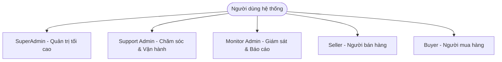
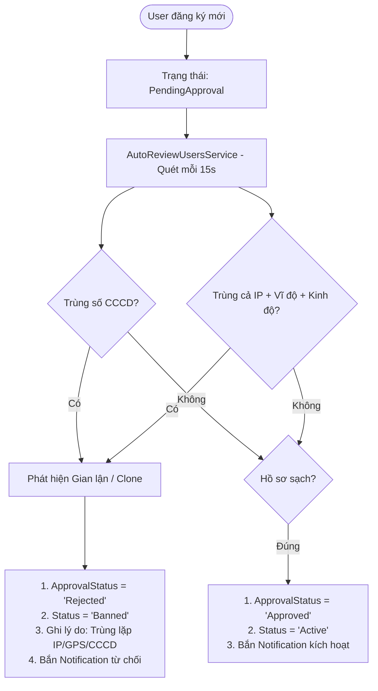
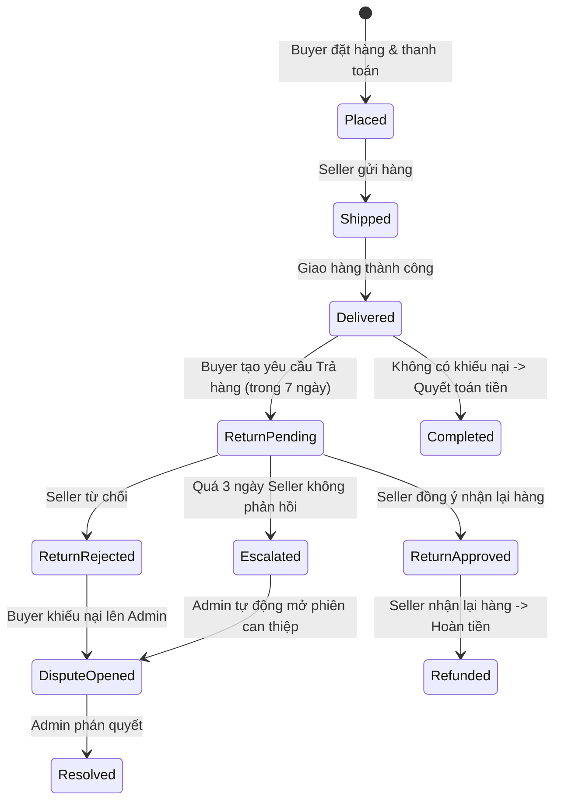
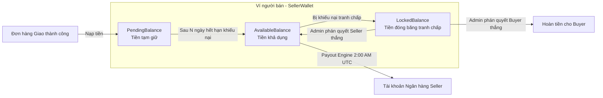

# TÀI LIỆU ĐẶC TẢ NGHIỆP VỤ HỆ THỐNG
## DỰ ÁN: EBAY CLONE - ADMIN & OPERATIONS MANAGEMENT PLATFORM

---

## 1. TỔNG QUAN HỆ THỐNG & BỐI CẢNH KINH DOANH (BUSINESS CONTEXT)

### 1.1. Mục tiêu kinh doanh
Hệ thống **eBay Clone** là một sàn thương mại điện tử đa người bán (**Multi-vendor Marketplace**) kết hợp mô hình C2C (khách hàng tới khách hàng) và B2C (doanh nghiệp tới khách hàng), hỗ trợ cả hình thức **Mua ngay (Fixed Price)** và **Đấu giá (Auction)**.

Hệ thống **Admin & Backend API** đóng vai trò là "Bộ não vận hành" (Operations Hub), giải quyết 5 bài toán nghiệp vụ sống còn:
1. **Trust & Safety (An toàn & Uy tín):** Ngăn chặn lừa đảo, phát hiện tài khoản nhân bản/clone, xác thực danh tính KYC tự động.
2. **Escrow & Financial Settlement (Bảo chứng & Quản trị dòng tiền):** Cơ chế giữ tiền bán hàng tạm thời (Escrow) để bảo vệ quyền lợi người mua và tự động giải ngân cho người bán khi đơn hàng hoàn tất an toàn.
3. **Dispute & Return Resolution (Xử lý tranh chấp & Khiếu nại):** Phòng hòa giải thời gian thực, cơ chế trọng tài phân xử công bằng.
4. **Content & Brand Protection (Kiểm duyệt nội dung & Sở hữu trí tuệ):** Tự động rà soát hàng cấm, vũ khí, chất độc hại và bản quyền thương hiệu (chương trình VeRO) thông qua AI.
5. **Operational Audit & Compliance (Kiểm toán vận hành):** Lưu vết toàn bộ hành vi của đội ngũ quản trị viên để đảm bảo tính minh bạch và bảo mật.

---

## 2. MA TRẬN PHÂN QUYỀN & CHÂN DUNG NGƯỜI DÙNG (ACTORS & ROLES)

Hệ thống áp dụng mô hình phân quyền kép **RBAC (Role-Based)** và **PBAC (Policy-Based)**:



### Bảng Ma trận Quyền hạn (Permissions Matrix)

| Phân hệ nghiệp vụ | Chức năng cụ thể | SuperAdmin | Support | Monitor | Mô tả nghiệp vụ |
| :--- | :--- | :---: | :---: | :---: | :--- |
| **Quản trị Admin** | Quản lý tài khoản Admin, phân vai trò | ✅ | ❌ | ❌ | Chỉ SuperAdmin mới được cấp quyền Admin khác. |
| **Audit Logs** | Xem lịch sử thao tác hệ thống | ✅ | ❌ | ❌ | Xem chi tiết thay đổi `before` / `after` dạng JSON. |
| **Dashboard & Báo cáo** | Xem chỉ số tổng quan, biểu đồ doanh thu | ✅ | ✅ | ✅ | Monitor chỉ có quyền xem (Read-only). |
| **Quản lý Người dùng** | Phê duyệt KYC, Khóa (Ban) / Mở khóa tài khoản | ✅ | ✅ | ❌ | Support trực tiếp thẩm định và xử phạt. |
| **Kiểm duyệt Sản phẩm** | Xóa/Ẩn sản phẩm vi phạm, rà soát VeRO | ✅ | ✅ | ❌ | Có sự hỗ trợ gắn cờ từ AI. |
| **Đơn hàng & Khiếu nại** | Theo dõi đơn hàng, xử lý Yêu cầu trả hàng | ✅ | ✅ | ❌ | Duyệt hoặc từ chối đơn đổi trả. |
| **Tranh chấp (Disputes)** | Tham gia phòng hòa giải, ra phán quyết hoàn tiền | ✅ | ✅ | ❌ | Phân định thắng/thua giữa Buyer & Seller. |
| **Kiểm duyệt Đánh giá** | Xóa review độc hại, phạt spammer | ✅ | ✅ | ❌ | Bảo vệ uy tín sản phẩm trên sàn. |
| **Tài chính & Ví sàn** | Điều chỉnh biểu phí sàn, ép chạy Payout Engine | ✅ | ❌ | ❌ | Quản lý dòng tiền và hoa hồng nền tảng. |
| **Thông báo** | Gửi thông báo phát sóng (Broadcast) toàn sàn | ✅ | ✅ | ❌ | Gửi pop-up/inbox cho toàn bộ user. |

---

## 3. ĐẶC TẢ CHI TIẾT CÁC PHÂN HỆ NGHIỆP VỤ (FUNCTIONAL MODULES)

---

### PHÂN HỆ 1: XÁC THỰC, PHÂN QUYỀN & AN TOÀN TRUY CẬP (IAM & SECURITY)

#### 1.1. Quy trình Đăng nhập Đa tầng (Multi-Factor Authentication Flow)
- **Mục tiêu:** Ngăn chặn việc đánh cắp tài khoản quản trị cấp cao.
- **Quy tắc nghiệp vụ (Business Rules):**
  1. **Chống Brute-force:** Áp dụng Rate Limiting tối đa **5 lần thử / phút trên mỗi IP**. Vượt quá sẽ bị chặn với mã `429 Too Many Requests`.
  2. **Xác thực Mật khẩu:** Mật khẩu được mã hóa bằng thuật toán `BCrypt`.
  3. **Kiểm tra trạng thái tài khoản:** Nếu tài khoản có `Status == 'Banned'`, hệ thống lập tức từ chối và trả về lý do bị cấm (`BannedReason`).
  4. **Kiểm tra 2FA (TOTP):**
     - Nếu `TwoFactorEnabled == true`: Hệ thống **chưa cấp token**, trả về `requireTwoFactor: true`.
     - Người dùng bắt buộc phải mở Google Authenticator / Microsoft Authenticator lấy mã 6 chữ số gửi qua endpoint `verify-2fa`.
  5. **Bảo mật phiên đăng nhập:** Token JWT được đặt vào **HttpOnly, Secure, SameSite=Strict Cookie** (tên cookie: `auth_token`, hạn 7 ngày). Tuyệt đối không trả Token về JavaScript/LocalStorage để triệt tiêu nguy cơ tấn công XSS.

#### 1.2. Hàng rào kiểm soát IP nội bộ (Internal IP Whitelist)
- **Quy tắc:** Chỉ những địa chỉ IP nằm trong danh sách trắng (`127.0.0.1`, `::1`, các dải mạng LAN/VPN nội bộ `192.168.1.*`, `10.*`) mới được phép gửi request đến API Admin.
- Request ngoài danh sách bị `InternalIpMiddleware` chặn ngay tại cửa ngõ với mã `403 Forbidden`.

---

### PHÂN HỆ 2: QUẢN LÝ NGƯỜI DÙNG & ĐỘNG CƠ PHÁT HIỆN GIAN LẬN (USER KYC & ANTI-FRAUD)



#### 2.1. Động cơ tự động rà soát tài khoản (Auto Review & Anti-Fraud Engine)
- **Bối cảnh:** Kẻ gian thường tạo nhiều tài khoản clone để tự mua hàng nâng điểm uy tín (shill bidding) hoặc lừa đảo chiếm đoạt mã khuyến mãi.
- **Quy tắc nghiệp vụ:**
  - Định kỳ mỗi **15 giây**, Background Service `AutoReviewUsersService` quét các user có `ApprovalStatus == 'PendingApproval'`.
  - **Thuật toán đối soát kép:**
    1. *Đối soát định danh:* Kiểm tra số Căn cước công dân (`CCCD`) đã tồn tại trên hệ thống chưa.
    2. *Đối soát vị trí vật lý:* So khớp đồng thời cả 3 tham số: Địa chỉ IP đăng nhập cuối (`LastLoginIp`) + Vĩ độ (`Latitude`) + Kinh độ (`Longitude`).
  - Nếu trùng lặp: Hệ thống tự động **TỪ CHỐI & KHÓA VĨNH VIỄN**, cập nhật lý do *"Hệ thống tự động từ chối: Phát hiện tài khoản trùng lặp (IP/Tọa độ/CCCD)"*.

#### 2.2. Hệ thống Xếp hạng Người bán (Seller Level & Performance Scoring)
Hệ thống duy trì điểm uy tín (`PerformanceScore` - khởi tạo 100 điểm) và tự động phân loại người bán vào ngày **20 hàng tháng**:

| Cấp độ người bán | Tiêu chuẩn đánh giá | Quyền lợi & Quy chế dòng tiền |
| :--- | :--- | :--- |
| **Top Rated** (Xuất sắc) | - Điểm uy tín $\ge 90$<br/>- Doanh số tối thiểu $\ge \$1,000$<br/>- Tỷ lệ khiếu nại $< 1\%$ | - Huy hiệu Top Rated trên sản phẩm.<br/>- **Thời gian giữ tiền bán hàng cực ngắn (1 - 3 ngày)** sau khi giao hàng thành công. |
| **Above Standard** (Đạt chuẩn) | - Điểm uy tín từ 70 đến 89<br/>- Hoạt động tối thiểu 30 ngày | - Hoạt động bình thường.<br/>- Thời gian giữ tiền tạm giữ tiêu chuẩn: **7 ngày**. |
| **Below Standard** (Dưới chuẩn) | - Điểm uy tín $< 70$<br/>- Tỷ lệ hủy đơn hoặc vi phạm cao | - Bị giới hạn số lượng sản phẩm đăng bán.<br/>- **Thời gian giữ tiền kéo dài (14 - 21 ngày)** để đảm bảo nguồn tiền đền bù khiếu nại. |

---

### PHÂN HỆ 3: QUẢN TRỊ SẢN PHẨM & KIỂM DUYỆT THÔNG MINH (PRODUCT MODERATION & AI)

#### 3.1. Quy trình Kiểm duyệt Nội dung Vi phạm & Chương trình VeRO
- **Bảo vệ quyền sở hữu trí tuệ (VeRO - Verified Rights Owner):** Chủ sở hữu thương hiệu (ví dụ: Nike, Apple, Sony) hoặc người mua có thể gửi `ProductReport` báo cáo sản phẩm vi phạm bản quyền hoặc hàng giả.
- **Tích hợp Trí tuệ Nhân tạo (OpenAI Moderation Service):**
  - Khi sản phẩm mới được đăng hoặc có báo cáo, hệ thống tự động gửi tiêu đề và mô tả sản phẩm sang mô hình AI.
  - AI phân tích ngữ cảnh tiếng Việt và tiếng Anh, nhận diện:
    - Hàng quốc cấm: Vũ khí, chất nổ, ma túy (`Illegal drugs`, `Weapons`).
    - Hàng giả, hàng nhái, tài liệu đồi trụy, link spam lừa đảo (`Spam link`, `Profanity`).
  - Kết quả trả về gắn cờ tự động: `TOXIC: [Lý do]` để đưa lên hàng đợi ưu tiên cho Admin xử lý.

#### 3.2. Cơ chế Chế tài Người bán Vi phạm (Seller Penalties)
Khi Admin xác nhận sản phẩm vi phạm:
1. **Gỡ bỏ sản phẩm:** Chuyển trạng thái sản phẩm sang ẩn hoặc xóa.
2. **Tích lũy số lần vi phạm (`ViolationCount`):**
   - Vi phạm lần 1 - 2: Gửi email cảnh báo qua `EmailService`.
   - Vi phạm lần 3: Khóa quyền đăng sản phẩm mới trong 7 ngày (`ProductBanUntil = Now + 7 days`).
   - Tái phạm nhiều lần: Tự động trừ điểm uy tín `PerformanceScore` và có thể khóa vĩnh viễn tài khoản bán hàng.

---

### PHÂN HỆ 4: VÒNG ĐỜI ĐƠN HÀNG, KHIẾU NẠI TRẢ HÀNG & LEO THANG TỰ ĐỘNG



#### 4.1. Cơ chế Tự động Leo thang Khiếu nại (Return Request Auto-Escalation)
- **Vấn đề thực tế:** Người bán cố tình "im lặng", không trả lời yêu cầu trả hàng của người mua để câu giờ cho hết hạn khiếu nại.
- **Quy tắc giải quyết:**
  - Background Service `ReturnRequestEscalationService` quét định kỳ mỗi **1 giờ**.
  - Nếu yêu cầu trả hàng ở trạng thái `Pending` quá **3 ngày (72 giờ)** mà Người bán không bấm Chấp nhận hay Từ chối:
    - Hệ thống tự động chuyển trạng thái sang **`Escalated` (Leo thang)**.
    - Kích hoạt thông báo Real-time qua SignalR tới nhóm Admin để đưa vào diện can thiệp khẩn cấp.

---

### PHÂN HỆ 5: PHÒNG HÒA GIẢI TRANH CHẤP TRỰC TUYẾN (DISPUTE MEDIATION ROOM)

Khi một khiếu nại không thể tự thỏa thuận, hệ thống sẽ khởi tạo một **Vụ tranh chấp chính thức (`Dispute`)**.

#### 5.1. Cơ chế Tranh tụng Real-time (Real-time Mediation)
- **Công nghệ hỗ trợ:** SignalR kết hợp **Redis Backplane** (đảm bảo tin nhắn tức thì xuyên suốt nhiều cụm máy chủ).
- **Thành phần tham gia:** Người mua (Buyer), Người bán (Seller) và Quản trị viên (Support Admin).
- **Tính năng trong phòng hòa giải:**
  - Nhắn tin, cung cấp bằng chứng hình ảnh (ảnh chụp hàng lỗi, biên bản đồng kiểm của bưu tá).
  - Admin theo dõi lịch sử đối thoại mà không bên nào có thể xóa/sửa nội dung.

#### 5.2. Quyền năng Phán quyết Trọng tài của Admin (Dispute Resolution)
Admin có toàn quyền đưa ra phán quyết cuối cùng dựa trên các kịch bản:

```
[Phán quyết của Admin]
   ├── 1. Buyer-Favored (Người mua thắng)
   │      └── Tiền tự động trừ từ Ví Seller hoàn về cho Buyer (Full Refund).
   │
   ├── 2. Seller-Favored (Người bán thắng)
   │      └── Bác yêu cầu bồi thường, giải phóng số dư đóng băng cho Seller.
   │
   └── 3. Partial Refund / Settlement (Thương lượng hòa giải)
          └── Hoàn một phần giá trị đơn hàng (ví dụ: Buyer giữ lại hàng bị xước nhẹ, nhận đền bù 30%).
```

---

### PHÂN HỆ 6: QUẢN TRỊ TÀI CHÍNH, BẢO CHỨNG VÍ & ĐỘNG CƠ GIẢI NGÂN (FINANCIAL ENGINE)

Đây là phân hệ cốt lõi đảm bảo tính toàn vẹn của dòng tiền trên sàn.



#### 6.1. Cấu trúc Ví Tiền 3 Số dư (Triple-Balance Architecture)
- **`PendingBalance` (Số dư tạm giữ / Ký quỹ):** Tiền thu từ khách khi đơn hàng giao thành công sẽ đổ vào đây. Người bán **không thể rút** khoản này.
- **`AvailableBalance` (Số dư khả dụng):** Tiền người bán đã toàn quyền sở hữu, có thể tạo lệnh rút tiền hoặc đợi hệ thống tự động giải ngân.
- **`LockedBalance` (Số dư phong tỏa):** Khi có tranh chấp hoặc nghi vấn gian lận, hệ thống trích một khoản từ số dư khả dụng sang đây để bảo lãnh, tránh việc Seller rút sạch tiền rồi bỏ trốn.

#### 6.2. Động cơ Tự động Quyết toán (Settlement Engine)
- Hoạt động liên tục thông qua `SettlementBackgroundService` (chu kỳ quét 15 giây).
- So sánh thời gian hiện tại với ngày quyết toán dự kiến của đơn hàng (`OrderTable.EstimatedSettlementDate`).
- **Quy tắc:** Nếu đơn hàng đã hoàn tất, không có khiếu nại mở và đã vượt qua thời hạn bảo lưu của Seller Level $\rightarrow$ Tự động chuyển tiền từ `PendingBalance` sang `AvailableBalance`, ghi nhận bút toán `FinancialTransaction`.

#### 6.3. Động cơ Chi trả & Giải ngân Hàng loạt (Automated Payout Engine)
- Chạy tự động vào lúc **2:00 AM UTC hàng ngày** (hoặc kích hoạt cưỡng bức "Force Run" từ Admin).
- **Quy trình:**
  1. Quét toàn bộ Seller có `AvailableBalance > 0` và đã cập nhật thông tin tài khoản ngân hàng (`BankAccountMock`).
  2. Tạo các giao dịch giải ngân `PayoutTransaction` ở trạng thái `Processing`.
  3. Gọi qua cổng thanh toán ngân hàng (`MockPaymentGatewayService`) để thực hiện lệnh chuyển khoản.
  4. Ghi nhận kết quả: Thành công (Success), Thất bại (Failed - ví dụ: số tài khoản đóng, vượt hạn mức ngày), Tạm hoãn (On Hold).

#### 6.4. Cơ chế Tính Phí Nền tảng (Platform Fees)
- Admin cấu hình biểu phí hoa hồng theo từng danh mục hàng hóa (ví dụ: Điện tử: 5%, Thời trang: 8%, Đấu giá cao cấp: 10%).
- Tiền phí sàn được tự động khấu trừ ngay khi giao dịch thanh toán thành công, ghi sổ vào tài khoản doanh thu của sàn.

---

### PHÂN HỆ 7: KIỂM TOÁN VẬN HÀNH & AN TOÀN DỮ LIỆU (AUDIT TRAIL & LOGGING)

Mọi thao tác can thiệp của Quản trị viên không thể bị chối bỏ (**Non-repudiation**):

```json
{
  "AdminId": 8,
  "AdminUsername": "superadmin",
  "Action": "BanUser",
  "TargetType": "User",
  "TargetId": 15,
  "Details": {
    "before": { "Status": "Active", "ViolationCount": 2 },
    "after":  { "Status": "Banned", "BannedReason": "Cố tình bán hàng cấm tái phạm lần 3" }
  },
  "IpAddress": "192.168.1.105",
  "CreatedAt": "2026-10-02T02:30:15Z"
}
```

- **Quy tắc lưu vết:**
  - Bắt buộc ghi lại trạng thái dữ liệu trước khi sửa (`before`) và sau khi sửa (`after`).
  - Ghi nhận chính xác địa chỉ IP của thiết bị thực hiện thao tác.
  - Phục vụ điều tra nội bộ khi xảy ra khiếu kiện hoặc tranh chấp pháp lý.

---

## 4. TỔNG KẾT LUỒNG NGHIỆP VỤ XUYÊN SUỐT (END-TO-END JOURNEY)

```
[NGƯỜI DÙNG]                 [NGƯỜI BÁN]                   [HỆ THỐNG / ADMIN]
     │                           │                                │
     ├── Đăng ký tài khoản ──────┼───────────────────────────────>│ AutoReview quét CCCD/GPS/IP
     │                           │                                │ ├── Hợp lệ -> Approve
     │                           │                                │ └── Trùng lặp -> Auto Ban
     │                           │                                │
     │                           ├── Đăng bán sản phẩm ──────────>│ OpenAI quét nội dung
     │                           │                                │ ├── Độc hại -> Gắn cờ vi phạm
     │                           │                                │ └── Hợp lệ -> Public sàn
     │                           │                                │
     ├── Mua hàng & Trả tiền ────┴───────────────────────────────>│ Tiền vào PENDING BALANCE
     │                           │                                │
     │<── Giao hàng thành công ──┤                                │
     │                           │                                │
     ├── KHÔNG khiếu nại (Sau N ngày) ───────────────────────────>│ Settlement Engine chuyển:
     │                                                            │ PENDING -> AVAILABLE
     │                                                            │ Payout Engine giải ngân về Bank
     │                                                            │
     └── CÓ KHIẾU NẠI (Trả hàng / Hàng lỗi) ──────────────────────>│
                                 │                                │ Tiền chuyển vào LOCKED BALANCE
                                 ├── Phản hồi thương lượng        │
                                 │   (Nếu im lặng quá 3 ngày) ───>│ Tự động Escalated lên Admin
                                 │                                │
                                 └── Đưa vào Dispute Room <───────┼──> Admin phân xử:
                                                                  │    ├── Buyer thắng -> Hoàn tiền
                                                                  │    └── Seller thắng -> Mở khóa tiền
```

---
